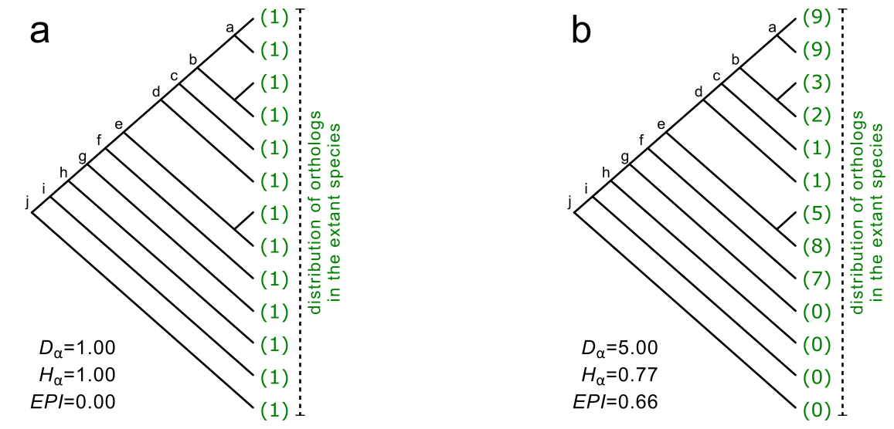
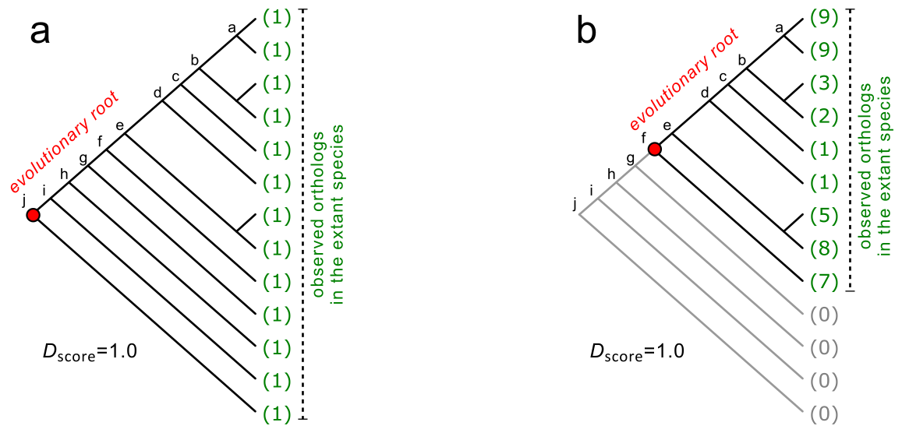
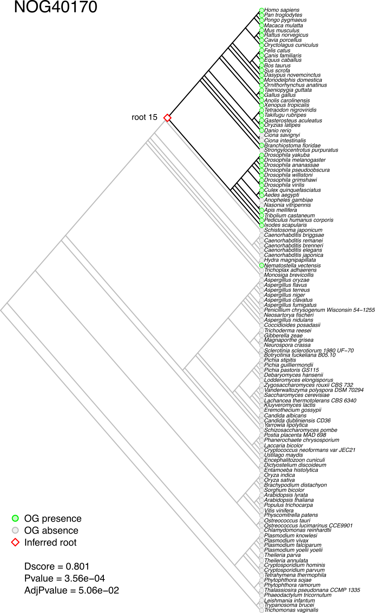
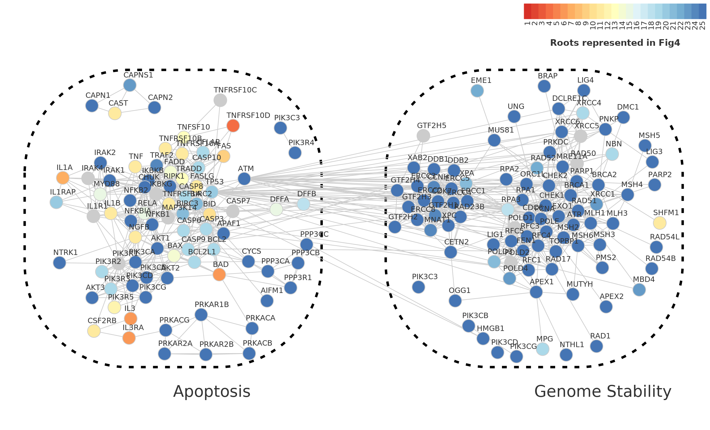
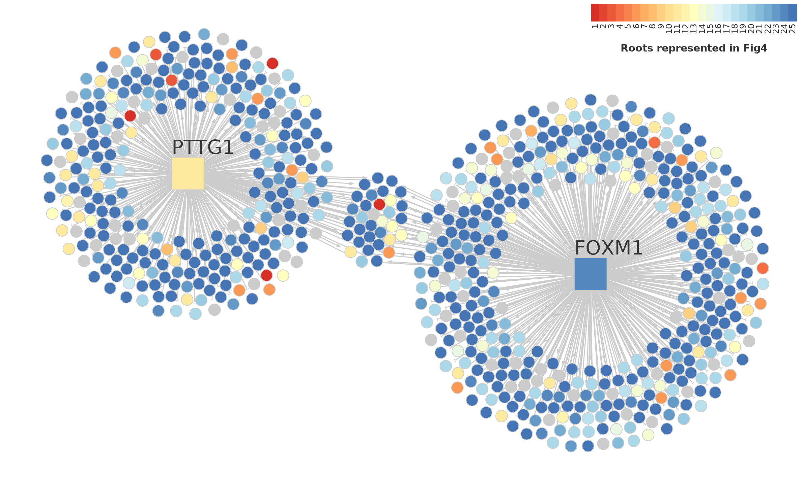
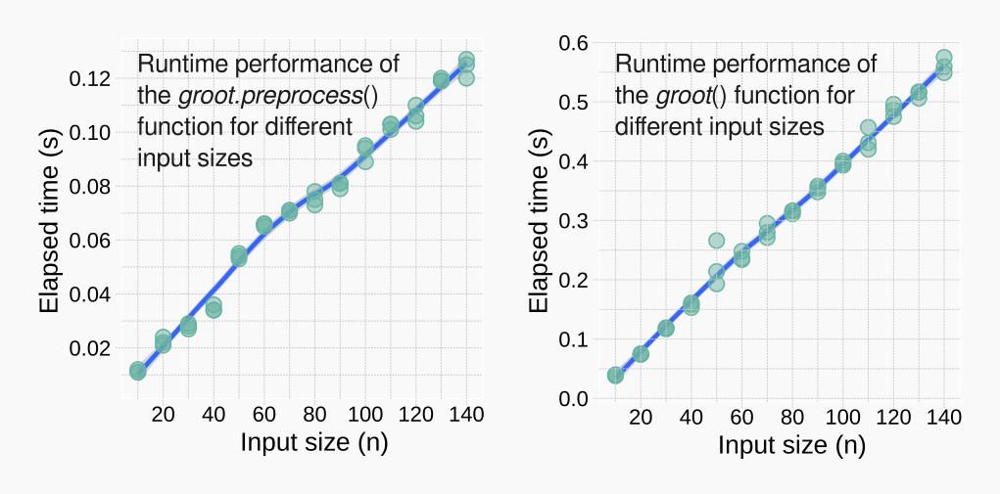

# Overview

*Geneplast* is designed for large-scale evolutionary analysis of orthologous groups, assessing the distribution of orthologous genes in a given species tree. **Figure 1** illustrates the distribution of two hypothetical orthologous groups in 13 species. Diversity (*Hα*) and abundance (*Dα*) are useful metrics to describe the distribution of orthologous genes in a species tree. *Geneplast* calculates *Hα* assessing the normalized Shannon’s diversity [@Castro2008]. High *Hα* represents an homogeneous distribution (**Figure 1a**), while low *Hα* indicates that few species concentrate most of the observed orthologous genes (**Figure 1b**). The abundance *Dα* is given by the number of orthologous genes divided by the number of species in the tree. *Geneplast* uses *Hα* and *Dα* to calculate an evolutionary plasticity index (*EPI*) as defined by @Dalmolin2011.


<b>Figure 1.</b> *Toy examples illustrating the distribution of orthologous genes in a given species tree*. (**a**) OG of low abundance (*Dα*) and high diversity (*Hα*). This hypothetical OG comprises orthologous genes observed in all species of the tree, without apparent deletions or duplications. (**b**) Example of an OG observed in many species, but not all. Numbers in parentheses represent the orthologous genes in each species.

In order to interrogate the evolutionary root of a given gene, *Geneplast* implements a new algorithm called *Bridge*, which assesses the probability that an ortholog is present in each Last Common Ancestor (LCA) of a species in a given species tree. The method is designed to deal with large-scale queries in order to interrogate, for example, all genes annotated in a network (please refer to @Castro2008 for additional examples).

To illustrate the rooting inference consider the evolutionary scenarios presented in **Figure 2** for the same hypothetical OGs from **Figure 1**. These OGs comprise a number of orthologous genes distributed among 13 species, and the pattern of presence or absence is indicated by green and grey colours, respectively. Observe that in **Figure 2a** at least one ortholog is present in all extant species. To explain this common genetic trait, a possible evolutionary scenario could assume that the ortholog was present in the LCA of all extant species and was genetically transmitted up to the descendants. For this scenario, the evolutionary root might be placed at the bottom of the species tree (i.e. node *j*). A similar interpretation could be done for OG in **Figure 2b**, but with the evolutionary root placed at node *f*. The *Bridge* algorithm infers the most consistent rooting scenario for the observed orthologs in a given species tree, computing a consistency score called *Dscore* and an associated empirical *p-value*. The *Dscore* is an estimate of the stability of the inferred roots and the empirical *p-value* is computed by permutation analysis.


<b>Figure 2.</b> *Evolutionary rooting scenarios for the same toy examples depicted in Figure 1*. (**a, b**) Red circles indicate the evolutionary roots that best explain the observed orthologs in the species tree.

# Quick start

We will use the `gpdata.gs` dataset available from the *Geneplast* package to demonstrate the analysis workflow. This dataset includes four objects containing orthology annotation derived from the *STRING database*, release 9.1. The `gpdata.gs` dataset is to be used for demonstration purposes only as it represents a subset of the STRING database. *Geneplast* can use other sources of orthology information, provided that the input data is set according to the `gpdata.gs` dataset.

```{r}
library(geneplast)
data(gpdata.gs)
```

## Evolutionary diversity and abundance

Next we will calculate diversity and abundance of orthologous groups using the `gplast` workflow. In the first step we will create an `OGP` object using the `gplast.preprocess` function, which will check the consistency of the input data. Then we will use the `gplast` function to perform diversity and abundance analysis, estimating the evolutionary plasticity index as defined by @Dalmolin2011. This example will assess orthology annotation available from the `gpdata.gs` dataset for 121 eukaryotic species.

1 - Create an object of class `OGP`.
```{r label='newOgp', eval=TRUE}
ogp <- gplast.preprocess(cogdata=cogdata, sspids=sspids, cogids=cogids, verbose=FALSE)
```

2 - Run the `gplast` function.
```{r label='gplastTest', eval=TRUE}
ogp <- gplast(ogp, verbose=FALSE)
```

3 - Get results.
```{r label='gplastRes', eval=TRUE}
res <- gplast.get(ogp, what="results")
head(res)
```

## Evolutionary rooting

The rooting analysis starts by running the `groot.preprocess` function, which will check the consistency of the input data. The user should provide **1**) a `cogdata` object, **2**) a `phyloTree` object, and **3**) set a reference species for which the evolutionary root of its genes will be inferred. Next, the `groot` function will perform the rooting analysis. The results are then retrieved by `groot.get` function. The pipeline returns the inferred root of each OG evaluated by the *Bridge* algorithm, including the *Dscore* and associated empirical *p-value*. Additionally, the `groot.plot` function allows the visualization of the inferred roots (e.g. **Figure 3**) and the LCAs of the reference species (**Figure 4**).

1 - Create an object of class `OGR`.
```{r label='newOgr', eval=TRUE}
ogr <- groot.preprocess(cogdata=cogdata, phyloTree=phyloTree, spid="9606", verbose=FALSE)
```

2 - Run the `groot` function.
```{r label='grootTest', eval=TRUE}
set.seed(1)
ogr <- groot(ogr, nPermutations=100, verbose=FALSE)
# Note: nPermutations is set to 100 for demonstration purposes; please set nPermutations=1000
```

3 - Get results.
```{r label='grootRes1', eval=TRUE}
res <- groot.get(ogr, what="results")
head(res)
```

4 - Check the inferred root of a given OG.
```{r label='grootRes2', eval=TRUE}
groot.plot(ogr, whichOG="NOG40170")
```

5 - Visualize the LCAs of the reference species in the analysis.
```{r label='rootRes', eval=TRUE}
groot.plot(ogr, plot.lcas = TRUE)
```


<b>Figure 3.</b> *Inferred evolutionary rooting scenario for NOG40170*. Monophyletic groups are ordered to show all branches of the tree below the queried species in the analysis.


<b>Figure 4.</b> *LCAs of the reference species in the analysis*.

# Case studies

## High-throughput rooting inference

This example shows how to assess all OGs annotated for *H. sapiens* in the
`r BiocStyle::Biocpkg("geneplast.data.string.v91")` package.

1 - Load orthogy data from the *geneplast.data.string.v91* package.

```{r, eval=FALSE}
# source("https://bioconductor.org/biocLite.R")
# biocLite("geneplast.data.string.v91")
library(geneplast.data.string.v91)
data(gpdata_string_v91)
```

2 - Create an object of class `OGR` for a reference `spid`.

```{r, eval=FALSE}
ogr <- groot.preprocess(cogdata=cogdata, phyloTree=phyloTree, spid="9606")
```

3 - Run the `groot` function and infer the evolutionary roots. 
*Note: this step may take a long processing time due to the large number of OGs in the input data (`nPermutations` argument is set to 100 for demonstration purpose only).*

```{r, eval=FALSE}
ogr <- groot(ogr, nPermutations=100, verbose=TRUE)
```

## Map rooting annotation to PPI networks

This example aims to show the evolutionary roots of a protein-protein interaction (PPI) network. The next steps show how to map evolutionary rooting annotation from *Geneplast* to a graph model. 
*Note: Gene annotation from the input PPI network must match the gene annotation available from the orthology data; in this example, ENTREZ IDs are used to match the datasets.*

1 - Load a PPI network and all packages required in this case study. The `ppi.gs` object provides PPI information from apoptosis and genome-stability genes [@Castro2008]. The `ppi.gs` is an object of class `igraph` and it will be used to set graph attributes following `igraph` syntax rules. For detais on how to handle `igraph` objects please see `r BiocStyle::CRANpkg("igraph")` and `r BiocStyle::Biocpkg("RedeR")` documentation.

```{r, eval=FALSE}
library(RedeR)
library(igraph)
library(RColorBrewer)
data(ppi.gs)
```

2 - Map rooting annotation to the `igraph` object.

```{r, eval=FALSE}
g <- ogr2igraph(ogr, cogdata, ppi.gs, idkey = "ENTREZ")
```

3 - Set colors for rooting annotations.

```{r, eval=FALSE}
pal <- brewer.pal(9, "RdYlBu")
color_col <- colorRampPalette(pal)(25)
g <- att.setv(g=g, from="Root", to="nodeColor", 
              cols=color_col, na.col="grey80", 
              breaks=seq(1,25))
```

4 - Adjust some `igraph` aesthetic attributes.

```{r, eval=FALSE}
g <- att.setv(g = g, from = "SYMBOL", to = "nodeAlias")
E(g)$edgeColor <- "grey80"
V(g)$nodeLineColor <- "grey80"
```

5 - Send the `igraph` object to the `r BiocStyle::Biocpkg("RedeR")` application.

```{r, eval=FALSE}
rdp <- RedPort()
calld(rdp)
resetd(rdp)
addGraph(rdp, g)
addLegend.color(rdp, colvec=g$legNodeColor$scale, 
                size=15, labvec=g$legNodeColor$legend, 
                title="Roots represented in Fig4")
relax(rdp)
```

6 - Group apoptosis and genome-stability genes into containers.

```{r, eval=FALSE}
myTheme <- list(nestFontSize=25, zoom=80, isNest=TRUE, gscale=65, theme=2)
nestNodes(rdp, nodes=V(g)$name[V(g)$Apoptosis==1], 
          theme=c(myTheme, nestAlias="Apoptosis"))
nestNodes(rdp, nodes=V(g)$name[V(g)$GenomeStability==1], 
          theme=c(myTheme, nestAlias="Genome Stability"))
relax(rdp, p1=50, p2=50, p3=50, p4=50, p5= 50)
```


<b>Figure 5.</b> *Inferred evolutionary roots of a protein-protein interaction network*.

## Map rooting annotation to regulatory networks

This example aims to show the evolutionary roots of regulons [@Fletcher2013]. The next steps show how to map evolutionary rooting annotation from *Geneplast* to a graph model.
*Note: Gene annotation from the input regulatory network must match the gene annotation available from the orthology data; in this example, ENTREZ IDs are used to match the datasets.*

1 - Load a regulatory network and all packages required in this case study. The `rtni1st` object provides regulons available from the `r BiocStyle::Biocpkg("Fletcher2013b")` data package computed from breast cancer data [@Fletcher2013].

```{r, eval=FALSE}
library(RTN)
library(Fletcher2013b)
library(RedeR)
library(igraph)
library(RColorBrewer)
data("rtni1st")
```

2 - Extract two regulons from the `rtni1st` object into an `igraph` object.

```{r, eval=FALSE}
regs <- c("FOXM1","PTTG1")
g <- tni.graph(rtni1st, gtype = "rmap", regulatoryElements = regs)
```

3 - Map rooting annotation to the `igraph` object.

```{r, eval=FALSE}
g <- ogr2igraph(ogr, cogdata, g, idkey = "ENTREZ")
```

4 - Set colors for rooting annotations.

```{r, eval=FALSE}
pal <- brewer.pal(9, "RdYlBu")
color_col <- colorRampPalette(pal)(25)
g <- att.setv(g=g, from="Root", to="nodeColor", 
              cols=color_col, na.col = "grey80", 
              breaks = seq(1,25))
```

5 - Adjust some `igraph` aesthetic attributes.

```{r, eval=FALSE}
idx <- V(g)$SYMBOL %in% regs
V(g)$nodeFontSize[idx] <- 30
V(g)$nodeFontSize[!idx] <- 1
E(g)$edgeColor <- "grey80"
V(g)$nodeLineColor <- "grey80"
```

6 - Send the `igraph` object to the `r BiocStyle::Biocpkg("RedeR")` application.

```{r, eval=FALSE}
rdp <- RedPort()
calld(rdp)
resetd(rdp)
addGraph(rdp, g, layout=NULL)
addLegend.color(rdp, colvec=g$legNodeColor$scale, 
                size=15, labvec=g$legNodeColor$legend, 
                title="Roots represented in Fig4")
relax(rdp, 15, 100, 20, 50, 10, 100, 10, 2)
```


<b>Figure 6.</b> *Evolutionary roots of FOXM1 and PTTG1 regulons*.

# Runtime performance of the rooting pipeline

```{r label='runtime', eval=FALSE}
#--- Load ggplot
library(ggplot2)
library(ggthemes)
library(egg)
library(data.table)

#--- Load cogdata
data(gpdata.gs)

#--- Get "OGs" that include a ref. species (e.g. "9606")
cogids <- unique(cogdata$cog_id[cogdata$ssp_id=="9606"])
length(cogids)
# [1] 142

#--- Make a function to check runtime for different input sizes
check.rooting.runtime <- function(n){
  cogids.subset <- cogids[1:n]
  cogdata.subset <- cogdata[cogdata$cog_id%in%cogids.subset,]
  rt1 <- system.time(
    ogr <- groot.preprocess(cogdata=cogdata.subset, phyloTree=phyloTree,
                            spid="9606", verbose=FALSE)
  )["elapsed"]
  rt2 <- system.time(
    ogr <- groot(ogr, nPermutations=100, verbose=FALSE)
  )["elapsed"]
  rtime <- c(rt1,rt2)
  names(rtime) <- c("runtime.preprocess","runtime.groot")
  return(rtime)
}
# check.rooting.runtime(n=5)

#--- Run check.rooting.runtime() for different input sizes (x3 iterations)
input_size <- seq.int(10,length(cogids),10)
iterations <- 1:3
elapsed_lt <- lapply(iterations, function(i){
  print(paste0("Iteration ",i))
  it <- sapply(input_size, function(n){
    print(paste0("- size...",n))
    check.rooting.runtime(n)
  })
})

#--- Get 'preprocess' runtime
runtime.preprocess <- sapply(elapsed_lt, function(lt){
  lt["runtime.preprocess",]
})
runtime.preprocess <- data.frame(InputSize=input_size, runtime.preprocess)
runtime.preprocess <- melt(as.data.table(runtime.preprocess), "InputSize")
colnames(runtime.preprocess) <- c("Input.Size","Iteration","Elapsed.Time")

#--- Get 'groot' runtime
runtime.groot <- sapply(elapsed_lt, function(lt){
  lt["runtime.groot",]
})
runtime.groot <- data.frame(InputSize=input_size, runtime.groot)
runtime.groot <- melt(as.data.table(runtime.groot), "InputSize")
colnames(runtime.groot) <- c("Input.Size","Iteration","Elapsed.Time")

#--- Plot runtime results
cls <- c("#69b3a2",adjustcolor("#69b3a2", alpha=0.5))
gg1 <- ggplot(runtime.preprocess, aes(x=Input.Size, y=Elapsed.Time)) +
  geom_smooth(method=loess, se=TRUE) +
  geom_point(color=cls[1], fill=cls[2], size=3, shape=21) +
  scale_x_continuous(breaks=pretty(runtime.preprocess$Input.Size)) +
  scale_y_continuous(breaks=pretty(runtime.preprocess$Elapsed.Time)) +
  theme_pander() + labs(title="groot.preprocess()") +
  xlab("Input size (n)") + ylab("Elapsed time (s)") +
  theme(aspect.ratio=1, plot.title=element_text(size=12))
gg2 <- ggplot(runtime.groot, aes(x=Input.Size, y=Elapsed.Time)) +
  geom_smooth(method=loess, se=TRUE) +
  geom_point(color=cls[1], fill=cls[2], size=3, shape=21) +
  scale_x_continuous(breaks=pretty(runtime.groot$Input.Size)) +
  scale_y_continuous(breaks=pretty(runtime.groot$Elapsed.Time)) +
  theme_pander() + labs(title="groot()") +
  xlab("Input size (n)") + ylab("Elapsed time (s)") +
  theme(aspect.ratio=1, plot.title=element_text(size=12))
grid.arrange(gg1, gg2, nrow = 1)
# pdf(file = "rooting_runtime.pdf", width = 7, height = 3)
# grid.arrange(gg1, gg2, nrow = 1)
# dev.off()
```


<b>Figure 7.</b> *Runtime performance of the rooting pipeline. Each point indicate the elapsed time to evaluate the 'check.rooting.runtime()' function, which assesses the execution time of the 'groot.preprocess()' and 'groot()' functions separatelly.*

# Orthology data packages

The `r BiocStyle::Biocpkg("geneplast.data")` package provides supporting data via `r BiocStyle::Biocpkg("AnnotationHub")` for the *Geneplast* evolutionary analyses. The `r BiocStyle::Biocpkg("geneplast.data")` package contains pre-processed data from different OG databases for use in the *Geneplast* package. In the current version, `r BiocStyle::Biocpkg("geneplast.data")` provides orthology information from STRING (https://string-db.org/), OMA Browser (https://omabrowser.org/), and OrthoDB (https://www.orthodb.org/).

# Session information

```{r label='Session information', eval=TRUE, echo=FALSE}
sessionInfo()
```

# References
