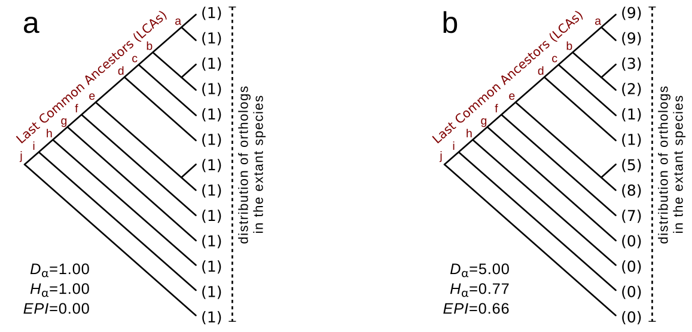

# Overview

**Geneplast** is designed for evolutionary and plasticity analysis based on the distribuion of orthologous groups in a given species tree. It uses Shannon information theory to estimate the Evolutionary Plasticity Index (EPI) (@Dalmolin2011, @Castro2008).

**Figure 1** shows a toy example to illustrate the analysis. The observed itens in **Figure 1a** are distributed evenly among the different species (i.e. high diversity), while **Figure 1b** shows the opposite case. The diversity is given by the normalized Shannon’s diversity and represents the distribution of orthologous and paralogous genes in a set of species. High diversity represents an homogeneous distribution among the evaluated species, while low diversity indicates that few species concentrate most of the observed orthologous genes.

The *EPI* characterizes the evolutionary history of a given orthologous group (OG). It accesses the distribution of orthologs and paralogs and is defined as,

$$EPI=1-\frac{H\alpha}{\sqrt{D\alpha}}, (1)$$

where *Dα* represents the OG abundance and *Hα* the OG diversity. Low values of *Dα* combined with high values for *Hα* indicates an orthologous group of low plasticity, that is, few OG members distributed over many species. It also indicates that the OG might have experienced few modifications (i.e. duplication and deletion episodes) during the evolution. Note that 0 ≤ *Hα* ≤ 1 and *Dα* ≥ 1. As a result, 0 ≤ *EPI* ≤ 1. For further information about the *EPI*, please see [@Dalmolin2011].



<b>Figure 1.</b> *Toy examples showing the distribution of orthologous and paralogous genes in a given species tree*. (**a**) OG of low abundance *Dα*, high diversity (*Hα*) and consequently low plasticity (*PI*). In this hypothetical case, the OG comprises orthologous genes observed in all species, without apparent deletion or duplication episodes. (**b**) in this example the OG is observed in many species, but not all, with many paralogs in some of them. Green numbers represents the number of orthologous genes in each species.

**geneplast** also implements a new algorithm called *Bridge* in order to interrogate the evolutionary root of a given gene based on the distribution of its orthologs. The *Bridge* algorithm assesses the probability that an ortholog of a given gene is present in each last common ancestor (LCA) of a given species (in a given species tree). As a result, this approach infers the evolutionary root representing the gene emergence. The method is designed to deal with large scale queries in order to interrogate, for example, all genes annotated in a network (please refer to [@Castro2008] for a case study illustrating the advantages of using this approach).

To illustrate the rooting inference consider the evolutionary scenarios presented in **Figure 2** for the same hypothetical OGs. These OGs comprise a number of orthologous genes distributed among 13 species, and the pattern of presence or absence is indicated by green and grey colours, respectively. Observe that at least one ortholog is present in all extant species in **Figure 2a**. To explain this common genetic trait, one possible evolutionary scenario could assume that the ortholog was present in the LCA of all species and was genetically transmitted up to the descendants. For this case, the evolutionary root might be placed at the bottom of the species tree (i.e. node *g*). The same reasoning can be done in **Figure 2b**, but with
the evolutionary root placed at node d. The **geneplast** rooting pipeline is designed to infer the most consistent rooting scenario for the observed orthologs in a given species tree. The pipeline provides a consistency score called *Dscore* which estimates the stability of the inferred root, as well as an associated empirical *p-value* computed by permutation analysis.


<b>Figure 2.</b> **Possible evolutionary rooting scenarios for the same toy examples depitected in Figure 1**. (**a, b**) Red circles indicate the evolutionary roots that best explain the observed orthologs in this species tree.


# Quick start

The orthology data required to run **geneplast** is available in the gpdata.gs dataset. This dataset includes four objects containing information about Clusters of Orthologous Groups derived from the **STRING database**, release 9.1. **geneplast** can also be used with other sources of orthology information, provided that the input is set according to the gpdata.gs data structure (*note: in order to reduce the processing time this example uses a subset of the STRING database*).

```{r}
library(geneplast)
data(gpdata.gs)
```

## Evolutionary plasticity inference
The first step is to create an OGP object by running the `gplast.preprocess` function. This example uses 121 eukaryotic species from the *STRING* database and all OGs mapped to the genome stabilty gene network [@Castro2008]. Next, the `gplast` function perform the plasticity analysis and the `gplast.get` returns the results:

1 - Create an object of class `OGP`.
```{r label='newOgp', eval=TRUE}
ogp <- gplast.preprocess(cogdata=cogdata, sspids=sspids, cogids=cogids, verbose=FALSE)
```

2 - Run the `gplast` function.
```{r label='gplastTest', eval=TRUE}
ogp <- gplast(ogp, verbose=FALSE)
```

3 - Get results.
```{r label='gplastRes', eval=TRUE}
res <- gplast.get(ogp,what="results")
head(res)
```

The results are returned in a 3-column `data.frame` with OG ids (cogids) identified in `row.names`. Columns are named as *abundance*, *diversity*, and *plasticity*.

The metric *abundance* simply indicates the ratio of orthologs and paralogs by species. For example, KOG0011 cromprises 201 genes distributed in 116 eukaryotic species, with a resulting abundance of 1.7328. Abundance of 1 indicates an one-to-one orthology relationship, while high abundance denotes many duplication episodes on the OG’s evolutionary history. Diversity is obtained applying normalized Shannon entropy on orthologous distribution and Plasticity is obtained by *EPI* index, as described equation (1).

## Evolutionary rooting inference

The rooting analysis starts with an `OGR` object by running the `groot.preprocess` function. This example uses all *OGs* mapped to the genome stability gene network using *H. sapiens* as reference species [@Castro2008] and is set to perform 100 permutations for demonstration purposes (for a full analysis, please set `Permutations`≥1000). Next, the `groot` function performs the rooting analysis and the results are retrieved by `groot.get`, which returns a `data.frame` listing the root of each OG evaluated by the `groot` method. The pipeline also returns the inconsistency score, which estimates the stability of the rooting analysis, as well as the associated empirical *p-value*. Additionally, the `groot.plot` function allows the visualization of the inferred root for a given OG (e.g. **Figure 3**) and the LCAs for the reference species (**Figure 4**).

1 - Create an object of class OGR.
```{r label='newOgr', eval=TRUE}
ogr <- groot.preprocess(cogdata=cogdata, phyloTree=phyloTree, spid="9606", cogids=cogids, verbose=FALSE)
```

2 - Run the groot function.
```{r label='grootTest', eval=TRUE}
set.seed(1)
ogr <- groot(ogr, nPermutations=100, verbose=FALSE)
```

3 - Get results.
```{r label='grootRes1', eval=TRUE}
res <- groot.get(ogr,what="results")
head(res)
```

4 - Check the inferred root of a given OG
```{r label='grootRes2', eval=TRUE}
groot.plot(ogr,whichOG="NOG40170")
```

5 - Visualization of the LCAs for the reference species in the analysis (i.e. H. sapiens)
```{r label='rootRes', eval=TRUE}
groot.plot(ogr,plot.lcas = TRUE)
```


<b>Figure 3.</b> *Inferred evolutionary rooting scenario for NOG40170*. Monophyletic groups are ordered to show all branches of the tree below the queried species in the analysis.


<b>Figure 4.</b> *Visualization of the LCAs for the reference species in the analysis*.

# Case study

This example aims to show the evolutionary root of regulons derived from breast cancer data [@Fletcher2013]. The idea is to map the appearance of each regulon (and the corresponding target genes) in a species tree. To make this work, we need to map the gene annotation derived from the **geneplast** data integration with the gene annotation available from the **RTN** and **Fletcher2013b** packages.

## Evolutionary rooting inference for all human genes

1 - Load orthogy data from the **geneplast.data.string.v91** package (*currently available under request*).

```{r, eval=FALSE}
library(geneplast.data.string.v91)
data(gpdata_string_v91)
```

2 - Get relevant OGs from `cogdata` object for the reference 'spid', in this case '9606' (H. sapiens).

```{r, eval=FALSE}
cogs9606 <- cogdata[cogdata$ssp_id=="9606",]
```

3 - Create an object of class 'OGR' for the reference 'spid'.

```{r, eval=FALSE}
ogr <- groot.preprocess(cogdata=cogdata, phyloTree=phyloTree, spid="9606", cogids=unique(cogs9606$cog_id), verbose=TRUE)
```

4 - Run the `groot` function and infer the evolutionary roots. 
*Note: this step should take a long processing time due to the large number of OGs in the input data (also, `nPermutations` argument is set to 100 for demonstration purpose only).*

```{r, eval=FALSE}
ogr <- groot(ogr, nPermutations=100, verbose=TRUE)
res <- groot.get(ogr, what="results")
```

5 - Map the inferred roots to related proteins of the reference 'spid'.

```{r, eval=FALSE}
idx <- match(cogs9606$cog_id, rownames(res))
cogs9606$Root <- res$Root[idx]
```

##Retrive regulon annotation

Load regulons from **Fletcher2013b** data package. The `rtni1st` represents a `TNI` class object with regulons computed from breast cancer data [@Fletcher2013].

```{r, eval=FALSE}
library(RTN)
library(Fletcher2013b)
data("rtni1st")
rtni1st <- upgradeTNI(rtni1st) # just upgrade to the latest RTN version!
```

1 - Get regulators annotated for each regulon. In this case, regulators represent transcription factors (TFs). *Note: gene identifiers should map to `cogs9606`*.

```{r, eval=FALSE}
regulon_TF <- tni.get(rtni1st, what = "regulatoryElements", idkey = "ENTREZ")
```

2 - Now get TF-targets annotated for each regulon.

```{r, eval=FALSE}
regulon_TAR <- tni.get(rtni1st, what = "regulons", idkey = "ENTREZ")
```

3 - Finally, get all gene annotation available from the `rtni1st` object.

```{r, eval=FALSE}
geneannot <- tni.get(rtni1st, what = "rowAnnotation")
rownames(geneannot) <- geneannot$ENTREZ
```

##Combine OG, root and gene annotation into a single dataset.

In this step the information from **geneplast** and **Fletcher2013b** is crossed using the ENTREZ identifiers.

```{r, eval=FALSE}
idx <- match(geneannot$ENTREZ,cogs9606$gene_id)
geneannot$COGID <- cogs9606$cog_id[idx]
geneannot$Root <- cogs9606$Root[idx]
```

##Map inferred roots to regulons into the 'TNI' object.
 
1 - Add roots to the `rtni1st` object.

```{r, eval=FALSE}
rtni1st@rowAnnotation <- cbind(rtni1st@rowAnnotation,geneannot[,c("COGID","Root")])
```

2 - Now get valid identifiers, representing those genes with root information.

```{r, eval=FALSE}
validTar <- rtni1st@rowAnnotation$PROBEID[!is.na(rtni1st@rowAnnotation$Root)]
validReg <- rtni1st@regulatoryElements[rtni1st@regulatoryElements %in% validTar]
```

3 - Reduce the `rtni1st` object to validated regulators and targets, including gene expression data and the regulatory network (i.e. `gexp`, `tn.ref`, `tn.dpi` matrices).

```{r, eval=FALSE}
rtni1st@regulatoryElements <- validReg
rtni1st@rowAnnotation <- rtni1st@rowAnnotation[validTar,]
rtni1st@gexp <- rtni1st@gexp[validTar,]
rtni1st@results$tn.ref <- rtni1st@results$tn.ref[validTar,validReg]
rtni1st@results$tn.dpi <- rtni1st@results$tn.dpi[validTar,validReg]
```

##Plot regulons and root information with RedeR

```{r, eval=FALSE}
library(RedeR)
library(igraph)
```

1 - Extract regulons into a graph format using `gtype = rmap`.

```{r, eval=FALSE}
regs <- rtni1st@regulatoryElements[c("FOXM1","PTTG1")]
g <- tni.graph(rtni1st, gtype = "rmap", tfs = regs)
```

2 - Map roots using collor attributes.

```{r, eval=FALSE}
library(RColorBrewer)
rcb<- brewer.pal(9, "Purples")
color_col <- colorRampPalette(rcb)(25) #cria função
g <- att.setv(g=g, from="Root", to="nodeColor", cols=color_col)
```

3 - Adjust font size for regulon names.

```{r, eval=FALSE}
idx <- V(g)$name %in% regs
V(g)$nodeFontSize[idx] <- 30
V(g)$nodeFontSize[!idx] <- 1
```

4 - Load **RedeR** graph package.

```{r, eval=FALSE}
rdp <- RedPort()
calld(rdp)
```

5 - Add graphs to **RedeR** interface.

```{r, eval=FALSE}
resetd(rdp)
addGraph( rdp, g, layout= NULL)
addLegend.color(rdp, colvec=g$legNodeColor$scale, size=15,
                labvec=g$legNodeColor$legend, title="Root")
relax(rdp, 20, 100, 20, 50, 10, 100, 10, 2)
```


<b>Figure 5.</b> *Inferred evolutionary roots of two regulators (FOXM1 and PTTG1) and the corresponding targets*.


# Session information

```{r label='Session information', eval=TRUE, echo=FALSE}
sessionInfo()
```

# References
