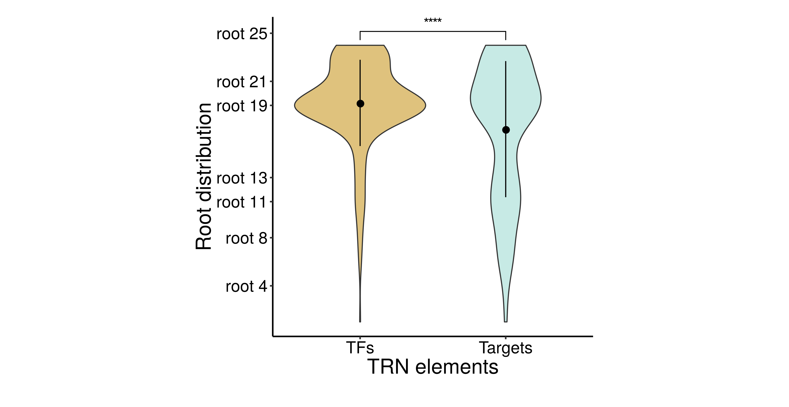

```{r setup, include=FALSE}
knitr::opts_chunk$set(echo = TRUE)
```

# Context

@Fletcher2013 reconstructed regulons for 809 transcription factors (TFs) using microarray transcriptomic data from the METABRIC breast cancer cohort [@Curtis2012]. **Our goal here is to assess the evolutionary root of the regulons reconstructed by @Fletcher2013** using the *geneplast* package. This script reproduces the main observations described in @Trefflich2019, which proposed a framework to explore the evolutiory roots of regulons.

# Package installation and data sets

Please make sure to install all required packages. Installing and then loading the *geneplast.data.string.v91* and *Fletcher2013b* data packages will make available all data required for this case study.

```{r eval=TRUE, message=FALSE, results='hide'}
#-- Call packages
library(geneplast)
library(geneplast.data.string.v91)
library(Fletcher2013b)
library(ggplot2)
library(ggpubr)
```

# Evolutionary rooting inference

This analysis will determine the evolutionary root of a gene based on the distribution of its orthologs in a given species tree. We will need two data objects, `cogdata` and `phyloTree`, loaded with the `gpdata_string_v91` call. The `cogdata` is a `data.frame` object with orthologous groups (OGs) predicted for 121 eukaryotic species, while the `phyloTree` is a phylogenetic tree object of class `phylo`. The `groot.preprocess` function checks the input data and builds an object of class `OGR`, which is used in the subsequent steps of the analysis pipeline.

```{r eval=FALSE, message=FALSE, warning=FALSE}
#-- Load orthology data from the 'geneplast.data.string.v91' package
data(gpdata_string_v91)

#-- Create an object of class 'OGR' for a reference 'spid'
ogr <- groot.preprocess(cogdata=cogdata, phyloTree=phyloTree, spid="9606")
```

The `groot` function addresses the problem of finding the evolutionary root of a feature in an phylogenetic tree. The method infers the probability that such feature was present in the Last Common Ancestor (LCA) of a given lineage. The `groot` function assesses the presence and absence of the orthologs in the extant species of the phylogenetic tree in order to build a probability distribution, which is used to identify vertical heritage patterns. The `spid=9606` parameter sets *Homo sapiens* as the reference species, which defines the ancestral lineage assessed in the query (*each ortholog of the reference species will be rooted in an ancestor of the reference species*).

```{r eval=FALSE, message=FALSE, warning=FALSE}
#-- Run the 'groot' function and infer the evolutionary roots
ogr <- groot(ogr, nPermutations=1000, verbose=TRUE)
```

# Root-to-gene mapping for regulons

In this section we will map the inferred evolutiory roots (available in the `ogr` object) to genes annotated in the regulons reconstructed by @Fletcher2013 (available in the `rtni1st` object). For a summary of the regulons in the `rtni1st` object we recommend using the `tni.regulon.summary` function, which shows that there are 809 regulatory elements (TFs) and 14131 targets.

```{r eval=FALSE, message=FALSE, warning=FALSE}
#-- Load regulons
data("rtni1st")
tni.regulon.summary(rtni1st)
```

```{r eval=FALSE, message=FALSE, warning=FALSE}
## This regulatory network comprised of 809 regulons. 
## regulatoryElements            Targets              Edges 
##                809              14131              47012 
## Min.  1st Qu.  Median    Mean  3rd Qu.   Max. 
## 0.0     10.0     37.0    58.1    80.0  523.0 
## regulatoryElements            Targets              Edges 
##                809              14131             617672 
## Min. 1st Qu.  Median    Mean 3rd Qu.    Max. 
##   0      43      449     764   1245    4148 
## ---
```

We will transform the `rtni1st` into a `graph` object using the `tni.graph` function. The resulting `graph` will be assessed by the `ogr2igraph` function, which will map the root-to-gene annotation; the results will be available in the `roots_df` data frame for subsequent analysis.

```{r eval=FALSE, message=FALSE, warning=FALSE}
#-- Put regulons into an 'igraph' object 
#-- Note: small regulons (n<15 targets) are romeved in this step.
graph <- tni.graph(rtni1st, gtype = "rmap")

#-- Map the 'ogr' object to the 'igraph' object
graph <- ogr2igraph(ogr, cogdata, graph, idkey = "ENTREZ")

#-- Make a data frame with the gene roots
roots_df <- data.frame(SYMBOL = V(graph)$SYMBOL,
                       ENTREZ = V(graph)$ENTREZ, 
                       Root = V(graph)$Root, 
                       TF_Targets = c("Targets","TFs")[V(graph)$tfs+1])
```

Please note that some level of missing annotation is expected, as not all gene ids listed in the `cogdata` might be available in the `graph` object. Also, small regulons (n < 15 targets) are removed by the `tni.graph` function. As a final pre-processing step, we will remove genes rooted at the base of the phylogenetic tree, for which the predictions can not discriminate from earlier ancestor roots. Here, 307 TFs and 6308 targets were retained.

```{r eval=FALSE}
#-- Remove NAs from missing annotation
roots_df <- roots_df[complete.cases(roots_df),]

#-- Remove genes rooted at the base of the phylogenetic tree
roots_df <- roots_df[roots_df$Root<max(roots_df$Root),]

#-- Check TF and target counts
table(roots_df$TF_Targets)
```

```{r eval=FALSE}
## Targets     TFs
##    6308     307
```


# Comparing regulators and targets

A transcriptional regulatory network (TRN) is formed by regulators (TFs) and target genes. The `roots_df` data frame lists the evolutionary roots inferred for each TRN element. The evolutionary roots are enumerated, from the most recent to the most ancestral node of the phylogenetic tree, i.e, `root 1`, `root 2`, ..., `root n` (please refer to @Trefflich2019 for additional details).

```{r eval=FALSE}
head(roots_df)
```

```{r eval=FALSE}
##     SYMBOL ENTREZ Root TF_Targets
## 10   CEBPG   1054   19        TFs
## 11   NR4A2   4929   17        TFs
## 14     EN1   2019   17        TFs
## 15    TP53   7157   20        TFs
## 16 GATAD2A  54815   19        TFs
## 17     DR1   1810   23        TFs
```

```{r eval=FALSE}
tail(roots_df)
```

```{r eval=FALSE}
##         SYMBOL ENTREZ Root TF_Targets
## 14087      F11   2160   19    Targets
## 14088   KCNK18 338567   24    Targets
## 14089  TMEM220 388335   14    Targets
## 14090 C1orf170  84808    7    Targets
## 14095 C16orf96 342346    6    Targets
## 14097    PANX3 116337   13    Targets
```

Here we will compare the distribution of the evolutionary roots inferred for TFs and target genes using the Wilcoxon-Mann-Whitney test, and then generate violin plots.

```{r eval=FALSE}
wilcox.test(Root ~ TF_Targets, data=roots_df)
```

```{r eval=FALSE}
## Wilcoxon rank sum test with continuity correction
## data:  Root by TF_Targets
## W = 812534, p-value = 1.6e-06
## alternative hypothesis: true location shift is not equal to 0
```

```{r eval=FALSE}
#-- Set roots to display in y-axis
roots <- c(4,8,11,13,19,21,25)

#-- Set a summary function to display dispersion within the violins
data_summary <- function(x) {
  y <- mean(x); ymin <- y-sd(x); ymax <- y+sd(x)
  return(c(y=y,ymin=ymin,ymax=ymax))
}

#-- Build a ggplot object
p <- ggplot(roots_df, aes(x=TF_Targets, y=Root)) + 
  geom_violin(aes(fill=TF_Targets), adjust=2, show.legend=F) +
  scale_y_continuous(breaks=roots, labels=paste("root",roots)) +
  scale_fill_manual(values=c("#c7eae5","#dfc27d")) +
  labs(x="TRN elements", y="Root distribution") +
  scale_x_discrete(limits=c("TFs","Targets")) +
  theme_classic() +
  theme(text=element_text(size=20)) + 
  stat_summary(fun.data = data_summary)

#-- Generate violin plots
p + stat_compare_means(method="wilcox.test",
                       comparisons =list(c("Targets","TFs")),
                       label = "p.signif")
```

```{r eval=FALSE, include=FALSE}
pdf(file = "regulon_roots.pdf", width =  5.5, height = 5)
p + stat_compare_means(method="wilcox.test",
                       comparisons =list(c("Targets","TFs")),
                       label = "p.signif")
dev.off()
```


<b>Figure 1.</b> Distribution of the inferred evolutionary roots of TFs and target genes.


# Session information

```{r label='Session information', eval=TRUE, echo=FALSE}
sessionInfo()
```

# References

