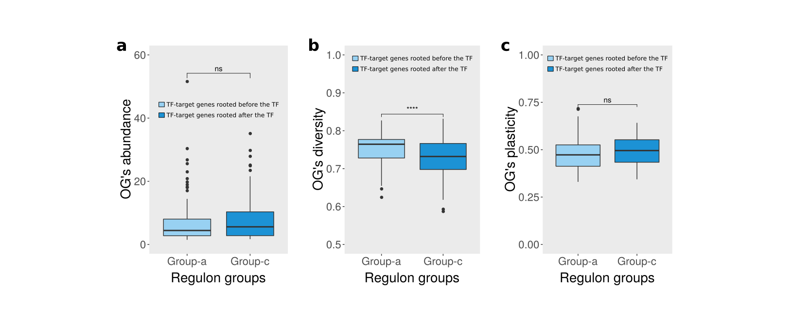

```{r setup, include=FALSE}
knitr::opts_chunk$set(echo = TRUE)
```


# Context

@Fletcher2013 reconstructed regulons for 809 transcription factors (TFs) using microarray transcriptomic data from breast tissue, either from cancer or normal samples [@Curtis2012]. **Our goal here is to assess the evolutionary root of the regulons reconstructed by @Fletcher2013** using the *geneplast* package. This script reproduces the main observations described in @Trefflich2019, which proposed a framework to explore the evolutionary roots of regulons.


# Package installation and data sets

Please make sure to install all required packages. Installing and then loading the *geneplast.data.string.v91* and *Fletcher2013b* data packages will make available all data required for this case study.

```{r eval=TRUE, message=FALSE, results='hide'}
#-- Call packages
library(geneplast)
library(geneplast.data.string.v91)
library(RTN)
library(Fletcher2013b)
library(ggplot2)
library(ggpubr)
library(plyr)
```


# Inferring evolutionary roots

This analysis will determine the evolutionary root of a gene based on the distribution of its orthologs in a given species tree. We will need two data objects, `cogdata` and `phyloTree`, both loaded with the `gpdata_string_v91` call. The `cogdata` is a `data.frame` object listing orthologous groups (OGs) predicted for 121 eukaryotic species, while the `phyloTree` is a phylogenetic tree object of class `phylo`. The `groot.preprocess` function will check the input data and build an object of class `OGR`, which will be used in the subsequent steps of the analysis pipeline.

```{r eval=FALSE, message=FALSE, warning=FALSE}
#-- Load orthology data from the 'geneplast.data.string.v91' package
data(gpdata_string_v91)

#-- Create an object of class 'OGR' for a reference 'spid'
ogr <- groot.preprocess(cogdata=cogdata, phyloTree=phyloTree, spid="9606")
```

The `groot` function addresses the problem of finding the evolutionary root of a feature in an phylogenetic tree. The method infers the probability that such feature was present in the Last Common Ancestor (LCA) of a given lineage. The `groot` function assesses the presence and absence of the orthologs in the extant species of the phylogenetic tree in order to build a probability distribution, which is used to identify vertical heritage patterns. The `spid=9606` parameter sets *Homo sapiens* as the reference species, which defines the ancestral lineage assessed in the query (*i.e. each ortholog of the reference species will be rooted in an ancestor of the reference species*).

```{r eval=FALSE, message=FALSE, warning=FALSE}
#-- Run the 'groot' function and infer the evolutionary roots
ogr <- groot(ogr, nPermutations=1000, verbose=TRUE)
```

# Evolutionary analysis of regulons generated from breast cancer samples

## Mapping root-to-gene annotation

In this section we will map the inferred evolutionary roots (available in the `ogr` object) to genes annotated in the regulons reconstructed by @Fletcher2013 from breast cancer samples (available in the `rtni1st` object; for the same analysis using normal samples, please see *section 5*). For a summary of the regulons in the `rtni1st` object we recommend using the `tni.regulon.summary` function, which shows that there are 809 regulatory elements (TFs) and 14131 targets.

```{r eval=FALSE, message=FALSE, warning=FALSE}
#-- Load regulons
data("rtni1st")
tni.regulon.summary(rtni1st)
```

```{r eval=FALSE, message=FALSE, warning=FALSE}
## This regulatory network comprised of 809 regulons. 
## -- DPI-filtered network: 
## regulatoryElements            Targets              Edges 
##                809              14131              47012 
##    Min. 1st Qu.  Median    Mean 3rd Qu.    Max. 
##     0.0    10.0    37.0    58.1    80.0   523.0 
## -- Reference network: 
## regulatoryElements            Targets              Edges 
##                809              14131             617672 
##    Min. 1st Qu.  Median    Mean 3rd Qu.    Max. 
##       0      43     449     764    1245    4148 
## ---
```

We will transform the `rtni1st` into a `graph` object using the `tni.graph` function. The resulting `graph` will be assessed by the `ogr2igraph` function, which will map the root-to-gene annotation; the results will be available in the `roots_df` data frame for subsequent analysis.

```{r eval=FALSE, message=FALSE, warning=FALSE}
#-- Put regulons into an 'igraph' object 
#-- Note: small regulons (n<15 targets) are romeved in this step.
graph <- tni.graph(rtni1st, gtype = "rmap")

#-- Map the 'ogr' object to the 'igraph' object
graph <- ogr2igraph(ogr, cogdata, graph, idkey = "ENTREZ")

#-- Make a data frame with the gene roots
roots_df <- data.frame(COGID = V(graph)$COGID,
                       SYMBOL = V(graph)$SYMBOL,
                       ENTREZ = V(graph)$ENTREZ, 
                       Root = V(graph)$Root,
                       TRN_element = c("Target","TF")[V(graph)$tfs+1],
                       stringsAsFactors = FALSE)
```

Please note that some level of missing annotation is expected, as not all gene ids listed in the `cogdata` might be available in the `graph` object. Also, small regulons (n < 15 targets) are removed by the `tni.graph` function. As a final pre-processing step, we will remove genes rooted at the base of the phylogenetic tree, for which the predictions can not discriminate from earlier ancestor roots. Here, 307 TFs and 6308 targets were retained.

```{r eval=FALSE}
#-- Remove NAs from missing annotation
roots_df <- roots_df[complete.cases(roots_df),]

#-- Remove genes rooted at the base of the phylogenetic tree
roots_df <- roots_df[roots_df$Root<max(roots_df$Root),]
rownames(roots_df) <- 1:nrow(roots_df)

#-- Check TF and target counts
table(roots_df$TRN_element)
```

```{r eval=FALSE}
## Target      TF
##   6308     307
```

## Comparing regulators and targets

A transcriptional regulatory network (TRN) is formed by regulators (TFs) and target genes. The `roots_df` data frame lists the evolutionary roots inferred for each TRN element, including whether the TRN element is annotated as TF or target.

```{r eval=FALSE}
head(roots_df)
```

```{r eval=FALSE}
##      COGID  SYMBOL ENTREZ Root  TRN_element
## 1  KOG3119   CEBPG   1054   19        TF
## 2  KOG4217   NR4A2   4929   17        TF
## 3  KOG0493     EN1   2019   17        TF
## 4 NOG80479    TP53   7157   20        TF
## 5  KOG3740 GATAD2A  54815   19        TF
## 6  COG5150     DR1   1810   23        TF
```

```{r eval=FALSE}
tail(roots_df)
```

```{r eval=FALSE}
##          COGID   SYMBOL ENTREZ Root TRN_element
## 6610   COG5640      F11   2160   19    Target
## 6611   KOG1418   KCNK18 338567   24    Target
## 6612  NOG39443  TMEM220 388335   14    Target
## 6613  NOG43522 C1orf170  84808    7    Target
## 6614 NOG127335 C16orf96 342346    6    Target
## 6615  NOG27843    PANX3 116337   13    Target
```

For example, *CEBPG* gene is placed at root 19 while *PANX3* gene is placed at root 13, indicating that the evolutionary root inferred for *CEBPG* is more ancestral than the evolutionary root inferred for *PANX3*. Please note that the evolutionary roots are enumerated from the most recent to the most ancestral node of the phylogenetic tree. Also, as the aim of the analysis is to find the root of the orthologs of the reference species, the root enumeration is related to the ancestral lineage of the reference species (for details of the phylogenetic tree, see **Figure S4** of the Geneplast's vignette).

Here we will compare the distribution of the evolutionary roots inferred for TFs and target genes using the Wilcoxon-Mann-Whitney test, and then generate violin plots (please refer to @Trefflich2019 for additional details).

```{r eval=FALSE}
#-- Assess root distribution by TRN_element
wilcox.test(Root ~ TRN_element, data=roots_df)
```

```{r eval=FALSE}
## Wilcoxon rank sum test with continuity correction
## data:  Root by TRN_element
## W = 812534, p-value = 1.6e-06
## alternative hypothesis: true location shift is not equal to 0
```

```{r eval=FALSE}
#-- Set roots to display in y-axis
roots <- c(4,8,11,13,19,21,25)

#-- Set a summary function to display dispersion within the violins
data_summary <- function(x) {
  y <- mean(x); ymin <- y-sd(x); ymax <- y+sd(x)
  return(c(y=y,ymin=ymin,ymax=ymax))
}

#-- (Figure S1) Generate violin plots showing root distribution by TRN_element
p <- ggplot(roots_df, aes(x=TRN_element, y=Root)) + 
  geom_violin(aes(fill=TRN_element), adjust=2, show.legend=F) +
  scale_y_continuous(breaks=roots, labels=paste("root",roots)) +
  scale_fill_manual(values=c("#c7eae5","#dfc27d")) +
  labs(x="TRN elements", y="Root distribution") +
  scale_x_discrete(limits=c("TF","Target"), labels=c("TFs","Targets")) +
  theme_classic() +
  theme(text=element_text(size=20)) + 
  stat_summary(fun.data = data_summary)
p + stat_compare_means(method="wilcox.test",
                       comparisons =list(c("TF","Target")),
                       label = "p.signif")
```

```{r eval=FALSE, include=FALSE}
pdf(file = "geneplast_Trefflich2019_1.pdf", width =  5.5, height = 5)
p + stat_compare_means(method="wilcox.test",
                       comparisons =list(c("TF","Target")),
                       label = "p.signif")
dev.off()
```


<b>Figure S1.</b> Distribution of the inferred evolutionary roots of TFs and target genes using regulons available from the `rtni1st` data object. ****P-value = 1.6e-06 (Wilcoxon-Mann-Whitney test).

Next we compute the root distance between a TF and its targets, and then generate a pie chart and a boxplot that reproduce the evolutionary scenarios discussed in @Trefflich2019.


```{r eval=FALSE}
#-- Get roots for TFs
idx <- roots_df$TRN_element=="TF"
tfroots <- roots_df$Root[idx]
names(tfroots) <- roots_df$SYMBOL[idx]

#-- Get roots for target genes
regulonlist <- tni.get(rtni1st, what = "regulons", idkey = "ENTREZ")[names(tfroots)]
targetroots <- lapply(regulonlist, function(reg){
  roots_df$Root[roots_df$ENTREZ%in%reg]
})

#-- Compute root distances between a TF and its targets
rootdist <- sapply(names(targetroots), function(reg){
  targetroots[[reg]]-tfroots[reg]
})

#-- Compute median root distances and sort related objects
rootdist_med <- sort(unlist(lapply(rootdist, median)), decreasing = T)
rootdist <- rootdist[names(rootdist_med)]
tfroots <- tfroots[names(rootdist_med)]
targetroots <- targetroots[names(rootdist_med)]
regulonlist <- regulonlist[names(rootdist_med)]

#-- Set regulon groups based on the median root distances
regulon_grouplist <- -sign(rootdist_med)+2
regulon_groupnames <- c("group_a","group_b","group_c")
regulon_groupcolors = c("#98d1f2","grey","#1c92d5")
names(regulon_groupcolors) <- regulon_groupnames
```


```{r eval=FALSE}
#-- (Figure S2) Generate a pie chart showing regulons grouped based on
#-- the median distance between a TF's root and its targets' roots
n <- as.numeric(table(regulon_grouplist))
pie(n, labels = paste(n,"regulons"), col = regulon_groupcolors, 
    border="white", cex=1.5, clockwise = TRUE, init.angle=0)
labs <- c("TF-target genes rooted before the TF (group-a)",
          "TF-target genes rooted with the TF (group-b)", 
          "TF-target genes rooted after the TF (group-c)")
legend("bottomleft", fill = regulon_groupcolors, bty = "n", legend = labs)
```

```{r eval=FALSE, include=FALSE}
pdf(file = "geneplast_Trefflich2019_2.pdf")
pie(n, labels = paste(n,"regulons"), col = regulon_groupcolors, 
    border="white", cex=1.5, clockwise = TRUE, init.angle=0)
legend("bottomleft", fill = regulon_groupcolors, bty = "n", legend = labs)
dev.off()
```

<b>Figure S2.</b> Regulons grouped based on the median distance between a TF's root and its targets' roots.


```{r eval=FALSE}
#-- (Figure S3) Generate a boxplot showing individual regulons 
#-- sorted by the median distance to TF root
plot.new()
par(usr=c(c(0,length(rootdist)),range(rootdist)))
boxplot(rootdist, horizontal= F, outline=FALSE, las=2, axes=FALSE, add=T,
        pars = list(boxwex = 0.6, boxcol=regulon_groupcolors[regulon_grouplist], 
                    whiskcol=regulon_groupcolors[regulon_grouplist]),
        pch="|", lty=1, lwd=0.75,
        col = regulon_groupcolors[regulon_grouplist])
abline(h=0, lmitre=5, col="#E69F00", lwd=3, lt=2)
par(mgp=c(2,0.1,0))
axis(side=1, cex.axis=1.2, padj=0.5, hadj=0.5, las=1, lwd=1.5, tcl= -0.2)
par(mgp=c(2.5,1.2,0.5))
axis(side=2, cex.axis=1.2, padj=0.5, hadj=0.5, las=1, lwd=1.5, tcl= -0.2)
legend("topright",legend = labs, fill = regulon_groupcolors, bty = "n")
title(xlab = "Regulons sorted by the median distance to TF root", ylab = "Distance to TF root")
```

<b>Figure S3.</b> Regulons sorted by the median distance to TF root.


```{r eval=FALSE, include=FALSE}
pdf(file = "geneplast_Trefflich2019_3.pdf", width = 15, height = 4)
plot.new()
par(usr=c(c(0,length(rootdist)),range(rootdist)))
boxplot(rootdist, horizontal= F, outline=FALSE, las=2, axes=FALSE, add=T,
        pars = list(boxwex = 0.6, boxcol=regulon_groupcolors[regulon_grouplist], 
                    whiskcol=regulon_groupcolors[regulon_grouplist]),
        pch="|", lty=1, lwd=0.75,
        col = regulon_groupcolors[regulon_grouplist])
abline(h=0, lmitre=5, col="#E69F00", lwd=3, lt=2)
par(mgp=c(2,0.1,0))
axis(side=1, cex.axis=1.2, padj=0.5, hadj=0.5, las=1, lwd=1.5, tcl= -0.2)
par(mgp=c(2.5,1.2,0.5))
axis(side=2, cex.axis=1.2, padj=0.5, hadj=0.5, las=1, lwd=1.5, tcl= -0.2)
legend("topright",legend = labs, fill = regulon_groupcolors, bty = "n")
title(xlab = "Regulons sorted by the median distance to TF root", ylab = "Distance to TF root")
dev.off()
```


## Comparing transcription factors and transcription co-factors

Transcription co-factors (TcoFs) are critical determinants of TF activities. TcoFs do not bind directly to DNA, but influence the transcriptional regulation by forming protein complexes with TFs. Next we will compare these two classes of regulators using the same approach described by @Trefflich2019, but now assessing the distribution of the evolutionary roots inferred for TFs and TcoFs. In order to run the subsequent snippets we will require the list of human TcoFs avaiable at the TcoF-DB Database [@Schmeier2016] (*please, download the 'TcoF-DB.xlsx' file as indicated below*).

```{r eval=FALSE}
#-- Please, download the 'TcoF-DB.xlsx' file from
#-- https://tools.sschmeier.com/tcof/browse/?type=tcof&species=human&class=all
#-- and then load it with the 'read_excel' function
library(readxl)
TcoF_DB <- read_excel("TcoF-DB.xlsx")

#-- Select high-confidence TcoFs according to TcoF Database
TcoF_DB <- TcoF_DB[TcoF_DB$Type=="TcoF: class HC",]

#-- Map 'TcoF_DB' to 'roots_df'
roots_df_TcoF_DB <- roots_df
roots_df_TcoF_DB$TRN_element <- NA
roots_df_TcoF_DB$TRN_element[roots_df$SYMBOL %in% TcoF_DB$Symbol] <- "TcoF"
roots_df_TcoF_DB$TRN_element[roots_df$TRN_element%in%"TF"] <- "TF"
roots_df_TcoF_DB <- roots_df_TcoF_DB[!is.na(roots_df_TcoF_DB$TRN_element),]
table(roots_df_TcoF_DB$TRN_element)
## TcoF   TF
##  146  307
```

```{r eval=FALSE}
#-- Assess root distribution by TRN_element
wilcox.test(Root ~ TRN_element, data=roots_df_TcoF_DB)
```

```{r eval=FALSE}
## Wilcoxon rank sum test with continuity correction
## data:  Root by TRN_element
## W = 22226, p-value = 0.884
## alternative hypothesis: true location shift is not equal to 0
```

```{r eval=FALSE}
#-- (Figure S4) Generate violin plots showing root distribution by TRN_element
p <- ggplot(roots_df_TcoF_DB, aes(x=TRN_element, y=Root)) + 
  geom_violin(aes(fill=TRN_element), adjust=2, show.legend=F) +
  scale_y_continuous(breaks=roots, labels=paste("root",roots)) +
  scale_fill_manual(values=c("#c7eae5","#dfc27d")) +
  labs(x="TRN elements", y="Root distribution") +
  scale_x_discrete(limits=c("TF","TcoF"), labels=c("TFs","TcoFs")) +
  theme_classic() +
  theme(text=element_text(size=20)) + 
  stat_summary(fun.data = data_summary)
p + stat_compare_means(method="wilcox.test",
                       comparisons =list(c("TF","TcoF")),
                       label = "p.signif")
```

```{r eval=FALSE, include=FALSE}
pdf(file = "geneplast_Trefflich2019_4.pdf", width =  5.5, height = 5)
p + stat_compare_means(method="wilcox.test",
                       comparisons =list(c("TF","TcoF")),
                       label = "p.signif")
dev.off()
```


<b>Figure S4.</b> Distribution of the inferred evolutionary roots of TFs and TcoFs (ns = not significant).


```{r eval=FALSE, include=FALSE}
# #-- Set repository link and file name
# repo_link <- "https://tools.sschmeier.com/tcof/ppi/?species=human&dnl=1&f=human_tf_interactions.csv"
# fname <- "human_tf_interactions.csv"
# 
# #-- Download CoF-TF interactions
# download.file(repo_link, fname)
# CoF_TF <- read.table(fname, head = TRUE, sep=",", stringsAsFactors = FALSE)[ ,1:6]
# colnames(CoF_TF) <- c("TF_Symbol", "TF_GeneID","TF_Type", "CoF_Symbol", "CoF_GeneID", "CoF_Type")
# CoF_TF <- CoF_TF[!CoF_TF$CoF_Type=="TF",]
# length(unique(CoF_TF$CoF_Symbol))
```


```{r eval=FALSE, include=FALSE}
# #-- Please, download the 'TcoF-DB.xlsx' file from 
# #-- https://tools.sschmeier.com/tcof/browse/?type=tf&species=human
# #-- and then load it with the 'read_excel' function
# library(readxl)
# TcoF_DB <- read_excel("TcoF-DB.xlsx", col_types = "text")
# 
# #-- Select high-confidence TcoFs according to TcoF Database
# TcoF_DB <- TcoF_DB[TcoF_DB$Type=="TcoF: class HC",]
# TcoF_DB <- TcoF_DB[,c("GeneID","Symbol")]
# TcoF_DB <- data.frame(TcoF_DB, stringsAsFactors = FALSE)
# 
# #-- Map COG IDs to TcoF_DB
# idx <- match(TcoF_DB$GeneID,cogdata$gene_id)
# TcoF_DB$COGID <- cogdata$cog_id[idx]
# 
# #-- Map roots to TcoF_DB
# results <- groot.get(ogr, what = "results")
# idx <- match(TcoF_DB$COGID, rownames(results))
# TcoF_DB$Root <- results$Root[idx]
# TcoF_DB <- TcoF_DB[complete.cases(TcoF_DB),]
# TcoF_DB$TRN_element <- "TcoF"
# 
# #-- Load a TF source
# data("tfsData")
# TF_DB <- tfsData$Carro2010
# colnames(TF_DB) <- c("GeneID","Symbol")
# 
# #-- Map COG IDs to TF_DB
# idx <- match(TF_DB$GeneID,cogdata$gene_id)
# TF_DB$COGID <- cogdata$cog_id[idx]
# 
# #-- Map roots to TF_DB
# results <- groot.get(ogr, what = "results")
# idx <- match(TF_DB$COGID, rownames(results))
# TF_DB$Root <- results$Root[idx]
# TF_DB <- TF_DB[complete.cases(TF_DB),]
# TF_DB$TRN_element <- "TF"
# 
# #-- Combine TF_DB and TcoF_DB
# roots_df_TF_TcoF <- rbind(TF_DB,TcoF_DB)
# 
# #-- Remove genes rooted at the base of the phylogenetic tree (see section 4.1)
# roots_df_TF_TcoF <- roots_df_TF_TcoF[roots_df_TF_TcoF$Root<max(roots_df_TF_TcoF$Root),]
# rownames(roots_df_TF_TcoF) <- 1:nrow(roots_df_TF_TcoF)
# 
# #-- Assess root distribution by TRN_element
# wilcox.test(Root ~ TRN_element, data=roots_df_TF_TcoF)
# ## Wilcoxon rank sum test with continuity correction
# ## data:  Root by TRN_element
# ## W = 43698, p-value = 0.6048
# ## alternative hypothesis: true location shift is not equal to 0
```


## Exploring abundance, diversity and plasticity

In this section we show how to calculate the OG's *abundance*, *diversity* and *plasticity*, and then map these three metrics to regulons (please, refer to @Castro2008 and @Dalmolin2011 for a detailed description). Briefly, the *abundance* metric represents the number of orthologs divided by the number of species annotated in a given OG; `abundance = 1` indicates an one-to-one relationship between the number of orthologs and species, while `abundance > 1` indicates that the number of orthologs exceeds the number of species. A large abundance value suggests a large number of paralogs annotated in the OG. The *diversity* metric represents the distribution of orthologs and paralogs in a given species tree; high diversity represents an homogeneous distribution (e.g. one ortholog in each species), while low diversity indicates that the orthologous genes are concentrated on few species (e.g. in a single branch of the species tree). The *plasticity* is the combination of abundance and diversity into a single metric. Low plasticity is observed in OGs of low abundance and high diversity (e.g. few orthologs distributed over many species), while high plasticity is observed in OGs of high abundance and low diversity (e.g. many orthologs concentrated on few species).


```{r eval=FALSE, message=FALSE, warning=FALSE}
#-- Compute OG's abundance, diversity and plasticity
ogp <- gplast.preprocess(cogdata=cogdata, sspids=phyloTree$tip.label)
ogp <- gplast(ogp)
gpres <- gplast.get(ogp, what="results")
head(gpres)
```

```{r eval=FALSE}
##         abundance diversity plasticity
## COG0001    1.3871    0.6889     0.4150
## COG0002    1.1346    0.8110     0.2386
## COG0003    1.3243    0.9506     0.1739
## COG0004    4.1753    0.8880     0.5654
## COG0005    2.5455    0.9283     0.4182
## COG0006    4.3167    0.9769     0.5298
```

```{r eval=FALSE}
#-- Map OG's abundance, diversity and plasticity to the 'roots_df' data frame
idx <- match(roots_df$COGID,rownames(gpres))
roots_df$Abundance <- gpres$abundance[idx]
roots_df$Diversity <- gpres$diversity[idx]
roots_df$Plasticity <- gpres$plasticity[idx]

#-- Then map OG's abundance, diversity and plasticity to regulons
stats_df <- lapply(regulonlist, function(reg){
  temp <- roots_df[roots_df$ENTREZ%in%reg,]
  apply(temp[ , c("Abundance","Diversity","Plasticity")], 2, mean)
})
stats_df <- ldply(stats_df, .id="Regulon", stringsAsFactors=FALSE)
stats_df$regulon_groups <- regulon_grouplist[stats_df$Regulon]
stats_df$regulon_groups <- regulon_groupnames[stats_df$regulon_groups]
```


```{r eval=FALSE, include=FALSE}
#-- Assess OG's abundance by regulon groups
wilcox.test(Abundance ~ regulon_groups, data=stats_df,
            subset = regulon_groups %in% c("group_a","group_c"))
## Wilcoxon rank sum test with continuity correction
## data:  Abundance by regulon_groups
## W = 7170, p-value = 0.1432
## alternative hypothesis: true location shift is not equal to 0

#-- Assess OG's diversity by regulon groups
wilcox.test(Diversity ~ regulon_groups, data=stats_df,
            subset = regulon_groups %in% c("group_a","group_c"))
## Wilcoxon rank sum test with continuity correction
## data:  Diversity by regulon_groups
## W = 4419, p-value = 5.181e-05
## alternative hypothesis: true location shift is not equal to 0

#-- Assess OG's plasticity by regulon groups
wilcox.test(Plasticity ~ regulon_groups, data=stats_df,
            subset = regulon_groups %in% c("group_a","group_c"))
## Wilcoxon rank sum test with continuity correction
## data:  Plasticity by regulon_groups
## W = 7338, p-value = 0.07175
## alternative hypothesis: true location shift is not equal to 0
```


```{r eval=FALSE, include=TRUE}
#-- (Figure S5a) Assess OG's abundance by regulon groups
p <- ggplot(stats_df, aes(x=regulon_groups, y=Abundance, fill=regulon_groups)) + 
  geom_boxplot(show.legend=F) +
  scale_y_continuous(limits = c(0,60)) +
  scale_x_discrete(limits=c("group_a","group_c")) +
  scale_fill_manual(values=regulon_groupcolors[c("group_a","group_c")]) +
  labs(x="Regulon groups", y="OG's abundance") +
  theme(panel.grid = element_blank()) +
  theme(text=element_text(size=20), axis.line.x=element_blank())
p + stat_compare_means(method="wilcox.test",
                       comparisons =list(c("group_a","group_c")),
                       label = "p.signif")
```

```{r eval=FALSE, include=FALSE}
pdf(file = "geneplast_Trefflich2019_5_abundance.pdf", width =  3.6, height = 5)
p + stat_compare_means(method="wilcox.test",
                       comparisons =list(c("group_a","group_c")),
                       label = "p.signif")
dev.off()
```


```{r eval=FALSE, include=TRUE}
#-- (Figure S5b) Assess OG's diversity by regulon groups
p <- ggplot(stats_df, aes(x=regulon_groups, y=Diversity, fill=regulon_groups)) + 
  geom_boxplot(show.legend=F) +
  scale_y_continuous(limits = c(0.5,1)) +
  scale_x_discrete(limits=c("group_a","group_c")) +
  scale_fill_manual(values=regulon_groupcolors[c("group_a","group_c")]) +
  labs(x="Regulon groups", y="OG's diversity") +
  theme(panel.grid = element_blank()) +
  theme(text=element_text(size=20), axis.line.x=element_blank())
p + stat_compare_means(method="wilcox.test",
                       comparisons =list(c("group_a","group_c")),
                       label = "p.signif")
```

```{r eval=FALSE, include=FALSE}
pdf(file = "geneplast_Trefflich2019_5_diversity.pdf", width =  3.6, height = 5)
p + stat_compare_means(method="wilcox.test",
                       comparisons =list(c("group_a","group_c")),
                       label = "p.signif")
dev.off()
```


```{r eval=FALSE, include=TRUE}
#-- (Figure S5c) Assess OG's plasticity by regulon groups
p <- ggplot(stats_df, aes(x=regulon_groups, y=Plasticity, fill=regulon_groups)) + 
  geom_boxplot(show.legend=F) +
  scale_y_continuous(limits = c(0,1)) +
  scale_x_discrete(limits=c("group_a","group_c")) +
  scale_fill_manual(values=regulon_groupcolors[c("group_a","group_c")]) +
  labs(x="Regulon groups", y="OG's plasticity") +
  theme(panel.grid = element_blank()) +
  theme(text=element_text(size=20), axis.line.x=element_blank())
p + stat_compare_means(method="wilcox.test",
                       comparisons =list(c("group_a","group_c")),
                       label = "p.signif")
```

```{r eval=FALSE, include=FALSE}
pdf(file = "geneplast_Trefflich2019_5_plasticity.pdf", width =  3.6, height = 5)
p + stat_compare_means(method="wilcox.test",
                       comparisons =list(c("group_a","group_c")),
                       label = "p.signif")
dev.off()
```


<b>Figure S5.</b>  OG’s abundance (a), diversity (b) and plasticity (c) mapped to regulons grouped based on the distance between the evolutionary roots of TFs and targets. ****P-value = 5.1e-5 (Wilcoxon-Mann-Whitney test); ns = not significant.

The abundance mapped to regulons whose TF-target genes are rooted *before* the TF (Group-a) is the same from that mapped to regulons whose TF-target genes are rooted *after* the TF (Group-c) (**Figure S5a**), suggesting that the number of orthologs per species is similar between the two groups. In contrast, the OG’s diversity mapped to Group-a is higher comparing with Group-c (P-value = 5.1e-5; Wilcoxon-Mann-Whitney test) (**Figure S5b**). As diversity estimates the dispersion of the orthologous genes in the species tree, this suggests that regulons in Group-a have orthologs more evenly distributed, which is usually observed for OGs rooted at the base of the phylogenetic tree [@Castro2008]. We did not detect any difference between Group-a and Group-c using the plasticity scores mapped to regulons (**Figure S5c**).


# Evolutionary analysis of regulons generated from normal breast tissue samples

Regulons are constructed based on a gene’s expression varying across a cohort. Large cohorts of tumour samples typically contain multiple molecular subtypes, and typically provide good expression variability for building regulons. In contrast, sample sets that are more homogeneous may be more challenging to explore with regulons, and this may be the case with sets of normal, non-cancerous samples. Despite this challenging, @Fletcher2013 generated regulons using normal breast tissue samples in order to observe regulatory differences between cancer and normal cells. Here we will run the same evolutionary analysis described in *section 4*, but now using regulons generated from normal breast tissue samples. In the next steps we show how to reproduce the previous results using a diferent TRN.


## Mapping root-to-gene annotation

```{r eval=FALSE, message=FALSE, warning=FALSE}
data("rtniNormals")
graph_normals  <- tni.graph(rtniNormals, gtype = "rmap")
graph_normals <- ogr2igraph(ogr, cogdata, graph_normals, idkey = "ENTREZ")
roots_df_normals <- data.frame(COGID = V(graph_normals)$COGID,
                       SYMBOL = V(graph_normals)$SYMBOL,
                       ENTREZ = V(graph_normals)$ENTREZ, 
                       Root = V(graph_normals)$Root,
                       TRN_element = c("Target","TF")[V(graph_normals)$tfs+1])
roots_df_normals <- roots_df_normals[complete.cases(roots_df_normals),]
roots_df_normals <- roots_df_normals[roots_df_normals$Root<max(roots_df_normals$Root),]
rownames(roots_df_normals) <- 1:nrow(roots_df_normals)
table(roots_df_normals$TRN_element)
```

```{r eval=FALSE}
## Target      TF
##   2818     130
```


## Comparing regulators and targets

```{r eval=FALSE}
#-- Assess root distribution by TRN_element
wilcox.test(Root ~ TRN_element, data=roots_df_normals)
```

```{r eval=FALSE}
## Wilcoxon rank sum test with continuity correction
## data:  Root by TRN_element
## W = 152522, p-value = 0.001148
## alternative hypothesis: true location shift is not equal to 0
```

```{r eval=FALSE}
#-- Set roots to display in y-axis
roots <- c(4,8,11,13,19,21,25)

#-- Set a summary function to display dispersion within the violins
data_summary <- function(x) {
  y <- mean(x); ymin <- y-sd(x); ymax <- y+sd(x)
  return(c(y=y,ymin=ymin,ymax=ymax))
}

#-- (Figure S6) Generate violin plots showing root distribution by TRN_element
p <- ggplot(roots_df_normals, aes(x=TRN_element, y=Root)) + 
  geom_violin(aes(fill=TRN_element), adjust=2, show.legend=F) +
  scale_y_continuous(breaks=roots, labels=paste("root",roots)) +
  scale_fill_manual(values=c("#c7eae5","#dfc27d")) +
  labs(x="TRN elements", y="Root distribution") +
  scale_x_discrete(limits=c("TF","Target"), labels=c("TFs","Targets")) +
  theme_classic() +
  theme(text=element_text(size=20)) + 
  stat_summary(fun.data = data_summary)
p + stat_compare_means(method="wilcox.test",
                       comparisons =list(c("TF","Target")),
                       label = "p.signif")
```

```{r eval=FALSE, include=FALSE}
pdf(file = "geneplast_Trefflich2019_6.pdf", width =  5.5, height = 5)
p + stat_compare_means(method="wilcox.test",
                       comparisons =list(c("TF","Target")),
                       label = "p.signif")
dev.off()
```


<b>Figure S6.</b> Distribution of the inferred evolutionary roots of TFs and target genes using regulons available from the `rtniNormals` data object. **P-value = 0.001148 (Wilcoxon-Mann-Whitney test).


# Session information

```{r label='Session information', eval=TRUE, echo=FALSE}
sessionInfo()
```

# References

